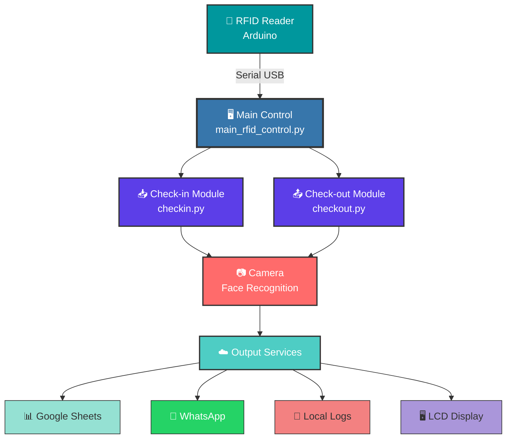
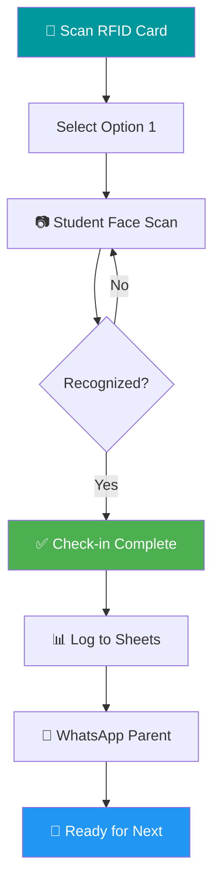
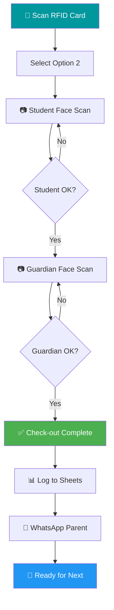

<div align="center">

# 🛡️ AI-Based Child Safety System

### *Intelligent RFID & Facial Recognition for Child Safety*

<p align="center">
  
  
  
  
</p>

<p align="center">
  
  
  
  
  
</p>

---

### 🎯 *Making Schools & Childcare Facilities Safer with AI*

An intelligent attendance and safety system that combines **RFID authorization**, **AI-powered facial recognition**, and **guardian verification** to ensure children's safety during check-in and check-out procedures.

[🚀 Quick Start](#-installation) • [📖 Documentation](#-configuration) • [🤝 Contributing](#-contributing) • [🐛 Report Bug](https://github.com/somesh-opps/AI-Based-Child-Safety-System/issues)

</div>

---

---

## 📋 Table of Contents

<details>
<summary><b>Click to expand</b></summary>

- [✨ Features](#-features)
- [🏗️ System Architecture](#️-system-architecture)
- [🔧 Prerequisites](#-prerequisites)
- [📦 Installation](#-installation)
- [⚙️ Configuration](#️-configuration)
- [🚀 Usage](#-usage)
- [📁 Project Structure](#-project-structure)
- [🔐 Security](#-security)
- [🐛 Troubleshooting](#-troubleshooting)
- [📊 Data Format](#-data-format)
- [🤝 Contributing](#-contributing)
- [📝 License](#-license)
- [👨‍💻 Author](#-author)

</details>

---

## ✨ Features

<table>
<tr>
<td width="50%">

### 🎯 Core Functionality
- 🔐 **RFID Authorization** - Secure access control
- 👤 **AI Face Recognition** - Automated student ID
- 👨‍👩‍👧 **Guardian Verification** - Safe check-out only
- 📊 **Google Sheets Sync** - Real-time cloud logging
- 💬 **WhatsApp Alerts** - Instant parent notifications
- 🖥️ **LCD Feedback** - Live status displays

</td>
<td width="50%">

### 🔒 Security Features
- �️ **Environment Config** - No hardcoded secrets
- 🚫 **Protected Files** - `.gitignore` safeguards
- ✅ **Config Validation** - Pre-flight checks
- 🔑 **Multi-Card Support** - Multiple authorized users
- 👥 **Multi-Guardian** - Flexible family structures

</td>
</tr>
<tr>
<td width="50%">

### 🎨 User Experience
- ⚡ **Real-time Processing** - Instant recognition
- 🔄 **Sequential Workflow** - Clear step-by-step
- ❌ **Duplicate Prevention** - No double entries
- 📝 **Detailed Logging** - Complete audit trail
- 🎯 **Smart Cooldowns** - Prevent accidental scans

</td>
<td width="50%">

### 🚀 Performance
- 🏃 **Fast Recognition** - Sub-second response
- 📷 **Adaptive Processing** - Configurable frame rates
- 💾 **Efficient Storage** - Optimized encodings
- 🌐 **Cloud Backup** - Automatic sync
- 🔄 **Background Tasks** - Non-blocking operations

</td>
</tr>
</table>

---

## 🏗️ System Architecture

<div align="center">



</div>

<details>
<summary><b>📝 Component Details</b></summary>

| Component | Technology | Purpose |
|-----------|-----------|---------|
| 🎴 **RFID Reader** | MFRC522 + Arduino | Authorization & mode control |
| 🖥️ **Main Control** | Python + PySerial | System orchestration |
| 📷 **Camera** | OpenCV + face_recognition | Face detection & matching |
| 📊 **Google Sheets** | gspread + Google API | Cloud attendance storage |
| 💬 **WhatsApp** | pywhatkit + PyAutoGUI | Parent notifications |
| 🖥️ **LCD Display** | Arduino I2C | Real-time user feedback |

</details>

---

## 🔧 Prerequisites

<table>
<tr>
<td width="50%" valign="top">

### 🔌 Hardware Requirements

```
✅ Arduino Uno/Mega/Compatible
✅ MFRC522 RFID Reader Module
✅ RFID Cards/Tags (13.56MHz)
✅ USB Webcam (720p+ recommended)
✅ LCD Display (16x2 or 20x4, I2C)
✅ Computer (Win/Linux/Mac)
✅ USB Cable for Arduino
```

</td>
<td width="50%" valign="top">

### 💻 Software Requirements

```
✅ Python 3.8 or higher
✅ Arduino IDE (latest version)
✅ Google Chrome Browser
✅ Google Cloud Account (free tier OK)
✅ WhatsApp Account
✅ Git (for cloning)
```

</td>
</tr>
</table>

<details>
<summary><b>📦 Key Python Dependencies</b></summary>

| Package | Version | Purpose |
|---------|---------|---------|
| `opencv-python` | 4.8+ | Computer vision & camera |
| `face-recognition` | 1.3+ | AI facial recognition |
| `pyserial` | 3.5+ | Arduino communication |
| `gspread` | 5.12+ | Google Sheets API |
| `pywhatkit` | 5.4+ | WhatsApp automation |
| `python-dotenv` | 1.0+ | Environment variables |
| `dlib` | 19.24+ | Face detection engine |
| `PyAutoGUI` | 0.9+ | GUI automation |

*See `requirements.txt` for complete list*

</details>

---

## 📦 Installation

<div align="center">

### 🚀 Quick Start Guide

</div>

<table>
<tr>
<td width="5%">1️⃣</td>
<td width="95%">

### Clone the Repository
```bash
git clone https://github.com/somesh-opps/AI-Based-Child-Safety-System.git
cd AI-Based-Child-Safety-System
```
</td>
</tr>

<tr>
<td>2️⃣</td>
<td>

### Install Python Dependencies
```bash
# 🎯 Recommended: Install in this order for best compatibility
pip install cmake
pip install dlib
pip install face-recognition
pip install -r requirements.txt
```

> 💡 **Tip:** Using a virtual environment? Activate it first!
> ```bash
> python -m venv venv
> venv\Scripts\activate  # Windows
> source venv/bin/activate  # Linux/Mac
> ```

</td>
</tr>

<tr>
<td>3️⃣</td>
<td>

### Set Up Arduino
1. 📝 Upload the RFID reader sketch to your Arduino
2. 🔧 Configure Arduino to send RFID data in format: `RFID:CARD_ID`
3. 🖥️ Set up LCD to receive commands via serial
4. 🔌 Connect Arduino to computer via USB

> 📚 **Need Arduino code?** Check Arduino examples for MFRC522

</td>
</tr>

<tr>
<td>4️⃣</td>
<td>

### Configure Google Cloud

<details>
<summary><b>Click for detailed Google Cloud setup</b></summary>

1. Go to [Google Cloud Console](https://console.cloud.google.com/)
2. Create a new project or select existing
3. Enable APIs:
   - ✅ Google Sheets API
   - ✅ Google Drive API
4. Create service account:
   - Navigate to **IAM & Admin** → **Service Accounts**
   - Click **Create Service Account**
   - Give it a name (e.g., "child-safety-system")
   - Grant **Editor** role
   - Create and download JSON key
5. Share your spreadsheet:
   - Create "Attendance Records" spreadsheet in Google Sheets
   - Share it with the service account email
   - Grant **Editor** permissions

</details>

</td>
</tr>

<tr>
<td>5️⃣</td>
<td>

### Set Up Student Database
Create directory structure:
```
STUDENTS/
├── Student_Name_1/
│   ├── 📸 photo1.jpg
│   ├── 📸 photo2.jpg
│   ├── 📱 phone.txt          (Format: +919876543210)
│   └── 👨‍👩‍👧 guardian/
│       ├── mother.jpg
│       └── father.jpg
├── Student_Name_2/
│   └── ...
```

> 💡 **Pro Tips:**
> - Use clear, well-lit photos
> - Multiple angles improve recognition
> - Guardians need multiple photos too
> - Phone format: `+[country][number]` (no spaces)

</td>
</tr>
</table>

<div align="center">

### ✅ Installation Complete!

*Proceed to [Configuration](#️-configuration) →*

</div>

---

## ⚙️ Configuration

<div align="center">

### 🔐 Secure Configuration Setup

*All sensitive data is stored in environment variables - never hardcoded!*

</div>

### Step 1️⃣: Create Environment File

<table>
<tr>
<td width="50%">

**Windows (PowerShell)**
```powershell
Copy-Item .env.example -Destination .env
```

</td>
<td width="50%">

**Linux/Mac (Bash)**
```bash
cp .env.example .env
```

</td>
</tr>
</table>

### Step 2️⃣: Edit Configuration

Open `.env` in your favorite editor and customize:

```ini
# ━━━━━━━━━━━━━━━━━━━━━━━━━━━━━━━━━━━━━━━━━━━━
# 🔌 ARDUINO CONFIGURATION
# ━━━━━━━━━━━━━━━━━━━━━━━━━━━━━━━━━━━━━━━━━━━━
ARDUINO_SERIAL_PORT=COM4                    # 💻 Windows: COMx | Linux: /dev/ttyUSB0
ARDUINO_BAUD_RATE=9600                      # ⚡ Must match Arduino sketch
RFID_AUTHORIZED_CARDS=ABC123,DEF456,GHI789  # 🎴 Your RFID card IDs (uppercase)

# ━━━━━━━━━━━━━━━━━━━━━━━━━━━━━━━━━━━━━━━━━━━━
# 📂 FILE PATHS
# ━━━━━━━━━━━━━━━━━━━━━━━━━━━━━━━━━━━━━━━━━━━━
STUDENTS_DIR=D:/Path/To/STUDENTS            # 👨‍👩‍👧‍👦 Student photos location
OUTPUT_FILE=D:/Path/To/attendance_log.txt   # 📝 Log file path
SERVICE_ACCOUNT_KEY_PATH=D:/Path/To/key.json # 🔑 Google credentials

# ━━━━━━━━━━━━━━━━━━━━━━━━━━━━━━━━━━━━━━━━━━━━
# ☁️ GOOGLE CLOUD
# ━━━━━━━━━━━━━━━━━━━━━━━━━━━━━━━━━━━━━━━━━━━━
GOOGLE_SHEETS_NAME=Attendance Records       # 📊 Spreadsheet name

# ━━━━━━━━━━━━━━━━━━━━━━━━━━━━━━━━━━━━━━━━━━━━
# 📷 CAMERA & AI SETTINGS
# ━━━━━━━━━━━━━━━━━━━━━━━━━━━━━━━━━━━━━━━━━━━━
CAM_INDEX=0                                 # 📹 0=default, 1=external
DETECTION_MODEL=hog                         # 🤖 'hog' (fast) or 'cnn' (accurate)
TOLERANCE=0.6                               # 🎯 0.0 (strict) - 1.0 (lenient)
FRAME_SCALE=0.5                             # ⚡ Lower = faster processing

# ━━━━━━━━━━━━━━━━━━━━━━━━━━━━━━━━━━━━━━━━━━━━
# 💬 WHATSAPP SETTINGS
# ━━━━━━━━━━━━━━━━━━━━━━━━━━━━━━━━━━━━━━━━━━━━
WHATSAPP_WAIT_TIME=4                        # ⏱️ Seconds to wait for WhatsApp Web
ENTER_DELAY_SEC=8                           # ⏱️ Delay before sending message
WHATSAPP_TAB_CLOSE_DELAY=12                 # ⏱️ Delay before closing tab
```

<details>
<summary><b>📖 Configuration Parameter Guide</b></summary>

| Parameter | Description | Example | Notes |
|-----------|-------------|---------|-------|
| `ARDUINO_SERIAL_PORT` | Arduino connection port | `COM4`, `/dev/ttyUSB0` | Check Device Manager (Win) |
| `RFID_AUTHORIZED_CARDS` | Comma-separated card IDs | `ABC123,DEF456` | Must be uppercase |
| `DETECTION_MODEL` | Face detection algorithm | `hog` or `cnn` | `hog`=CPU, `cnn`=GPU |
| `TOLERANCE` | Face match threshold | `0.6` | Lower=stricter |
| `FRAME_SCALE` | Processing resolution | `0.5` | Lower=faster |

</details>

### Step 3️⃣: Validate Configuration

```bash
python config_template.py
```

<div align="center">

**Expected Output:**

```
✅ Arduino Port: COM4
✅ Baud Rate: 9600
✅ Authorized RFID Cards: 3 cards
✅ Students Directory: D:/Path/To/STUDENTS
✅ Output File: D:/Path/To/attendance_log.txt
✅ Service Account Key: D:/Path/To/key.json
✅ Google Sheets: Attendance Records

🔍 Validating configuration...
✅ All configuration is valid!
```

</div>

> ⚠️ **Important:** Never commit `.env` file! It's protected by `.gitignore`

---

## 🚀 Usage

<div align="center">

### 🎮 Starting the System

```bash
python main_rfid_control.py
```


</div>

---

### 📋 Workflow Overview

<table>
<tr>
<td width="50%" align="center">

#### 🟢 Check-In Mode
*Student Arrival - Morning*



</td>
<td width="50%" align="center">

#### 🔴 Check-Out Mode
*Student Departure - Afternoon*



</td>
</tr>
</table>

---

### 🎯 Step-by-Step Guide

<details open>
<summary><b>1️⃣ Authorization</b></summary>

<br/>

1. 🎴 **Scan authorized RFID card** on the reader
2. 🖥️ LCD displays: *"Card Scanned! Choose Mode: 1/2"*
3. 💻 Terminal prompts for option:
   ```
   [SYSTEM] Please choose an option:
     1. Start Check-in
     2. Start Check-out
   Enter your choice (1 or 2): _
   ```

</details>

<details open>
<summary><b>2️⃣ Check-In Process</b></summary>

<br/>

| Step | Action | System Response |
|------|--------|-----------------|
| 1️⃣ | Type `1` and press Enter | 📷 Camera activates |
| 2️⃣ | Student faces camera | 🔍 Face detection starts |
| 3️⃣ | Face recognized | ✅ "C/I: [Student Name]" on LCD |
| 4️⃣ | System processes | 📊 Logs to Google Sheets |
| 5️⃣ | Background task | 💬 Sends WhatsApp to parent |
| 6️⃣ | Ready for next | 🔄 "Check-in Active" on LCD |

> 💡 **Tip:** Multiple students can check in sequentially without re-scanning RFID

> 🛑 **To Stop:** Scan RFID card again or press `Ctrl+C`

</details>

<details open>
<summary><b>3️⃣ Check-Out Process</b></summary>

<br/>

| Step | Action | System Response |
|------|--------|-----------------|
| 1️⃣ | Type `2` and press Enter | 📷 Camera activates |
| 2️⃣ | Student faces camera | 🔍 Student face detection |
| 3️⃣ | Student recognized | ⏳ "Scan Guardian for [Name]" |
| 4️⃣ | 5-second preparation time | ⏱️ Countdown displayed |
| 5️⃣ | Guardian faces camera | 🔍 Guardian verification |
| 6️⃣ | Guardian verified | ✅ "C/O: [Student]" on LCD |
| 7️⃣ | System processes | 📊 Logs with guardian name |
| 8️⃣ | Background task | 💬 WhatsApp notification sent |
| 9️⃣ | Ready for next | 🔄 "Checkout Active" on LCD |

> ⚠️ **Security:** Only registered guardians can check out students

> 🛑 **To Stop:** Scan RFID card again or press `Ctrl+C`

</details>

---

### 🆘 Emergency Controls

<div align="center">

| Control | Action |
|---------|--------|
| `Ctrl+C` | **Force stop** system immediately |
| 🎴 **RFID Scan** | **Graceful stop** current mode |
| `Q` key | **Close camera** window (optional) |

</div>

---

## 📁 Project Structure

```
AI-Based-Child-Safety-System/
├── 📄 main_rfid_control.py      # Main control system
├── 📄 checkin.py                # Check-in module with face recognition
├── 📄 checkout.py               # Check-out module with guardian verification
├── 📄 config_template.py        # Configuration loader (loads from .env)
├── 📄 requirements.txt          # Python dependencies
├── 📄 README.md                 # This file
├── 📄 SECURITY_SETUP.md         # Detailed security documentation
├── 📄 IMPLEMENTATION_SUMMARY.md # Quick implementation guide
├── 📄 .env.example              # Environment variables template
├── 📄 .gitignore                # Git ignore rules (protects sensitive files)
│
├── 📁 STUDENTS/                 # Student database (not committed)
│   └── [Student_Name]/
│       ├── *.jpg                # Student photos
│       ├── phone.txt            # Parent WhatsApp number
│       └── guardian/
│           └── *.jpg            # Guardian photos
│
├── 🔒 .env                      # Your secrets (not committed)
├── 🔒 *-service-account.json    # Google credentials (not committed)
└── 📋 attendance_log.txt        # Output logs (not committed)
```

---

## 🔐 Security

<div align="center">

### 🛡️ Security-First Architecture

*Your data is protected at every level*

</div>

<table>
<tr>
<td width="50%">

### 🔒 Protected Information
- ✅ Service account credentials (JSON)
- ✅ RFID card IDs
- ✅ Student personal data & photos
- ✅ Parent phone numbers
- ✅ File paths & system config
- ✅ API keys & tokens
- ✅ Attendance logs

</td>
<td width="50%">

### 🛡️ Security Measures
- ✅ Environment variable configuration
- ✅ `.gitignore` protection
- ✅ Pre-flight validation
- ✅ No hardcoded secrets
- ✅ Runtime credential loading
- ✅ Secure file permissions
- ✅ Audit trail logging

</td>
</tr>
</table>

---

### ⚠️ Critical Security Rules

<div align="center">

| ❌ NEVER DO | ✅ ALWAYS DO |
|-------------|--------------|
| Commit `.env` file | Review `git status` before commit |
| Commit `*.json` credentials | Keep service keys outside repo |
| Commit student photos | Use `.gitignore` properly |
| Share RFID card IDs publicly | Rotate credentials regularly |
| Hardcode secrets in code | Use environment variables |
| Push without checking | Validate configuration first |

</div>

---

### 🔐 Security Checklist

Before committing code:

- [ ] ✅ `.gitignore` is in place
- [ ] ✅ `.env` file is NOT staged
- [ ] ✅ `*.json` files are NOT staged
- [ ] ✅ Student data is NOT staged
- [ ] ✅ No hardcoded credentials in code
- [ ] ✅ Configuration validated with `config_template.py`
- [ ] ✅ Reviewed `git status` output
- [ ] ✅ Reviewed `git diff` changes

---

<div align="center">

### 📖 Comprehensive Security Guide

For detailed security setup and best practices, read:

**[� SECURITY_SETUP.md](SECURITY_SETUP.md)**

*This guide covers installation, configuration, and security hardening*

</div>

---

## 🐛 Troubleshooting

### Common Issues

#### "Import dotenv could not be resolved"
```bash
pip install python-dotenv
```

#### "Serial port not found" or "Access denied"
- **Windows**: Check Device Manager for correct COM port
- **Linux**: Add user to `dialout` group: `sudo usermod -a -G dialout $USER`
- Verify Arduino is connected and drivers are installed

#### "No face detected" or "Face not recognized"
- Ensure good lighting conditions
- Student should face camera directly
- Add more photos of the student from different angles
- Adjust `TOLERANCE` in `.env` (increase for more lenient matching)

#### "Google Sheets authentication failed"
- Verify service account JSON path in `.env`
- Ensure spreadsheet is shared with service account email
- Check that Sheets API and Drive API are enabled in Google Cloud

#### "WhatsApp message not sent"
- Ensure Google Chrome is installed
- WhatsApp Web must be logged in
- Check internet connection
- Verify phone number format: `+[country_code][number]` (e.g., `+919876543210`)

#### Camera not working
- Try different `CAM_INDEX` values (0, 1, 2...)
- Check camera permissions
- Close other apps using camera
- On Linux, check `/dev/video*` permissions

---

## 📊 Data Format

### Phone Numbers (`phone.txt`)
```
+919876543210
```
Format: `+[country_code][phone_number]` (no spaces or hyphens)

### Google Sheets Structure
The system automatically creates columns with format:
```
| Name      | 2025-10-19 (Check-in) | 2025-10-19 (Check-out) |
|-----------|------------------------|-------------------------|
| Student_1 | 08:30:15              | 15:45:20 (Guardian: Mom)|
| Student_2 | 08:35:42              | 16:00:10 (Guardian: Dad)|
```

---

## 🤝 Contributing

Contributions are welcome! Please follow these guidelines:

1. Fork the repository
2. Create a feature branch (`git checkout -b feature/AmazingFeature`)
3. Commit your changes (`git commit -m 'Add some AmazingFeature'`)
4. Push to the branch (`git push origin feature/AmazingFeature`)
5. Open a Pull Request

**⚠️ Important:** Never include sensitive data in pull requests!

---

## 📝 License

This project is licensed under the MIT License - see the [LICENSE](LICENSE) file for details.

---

## 👨‍💻 Author

**Somesh**
- GitHub: [@somesh-opps](https://github.com/somesh-opps)
- Repository: [AI-Based-Child-Safety-System](https://github.com/somesh-opps/AI-Based-Child-Safety-System)

---

## 🙏 Acknowledgments

- **OpenCV** - Computer vision library
- **face_recognition** - Facial recognition built on dlib
- **Arduino** - Microcontroller platform
- **Google Cloud** - Sheets API and cloud services
- **pywhatkit** - WhatsApp automation

---

## 📞 Support

If you encounter issues:
1. Check the [Troubleshooting](#-troubleshooting) section
2. Review `SECURITY_SETUP.md` for configuration help
3. Run configuration validator: `python config_template.py`
4. Open an issue on GitHub with detailed error messages

---

## 🔄 Version History

- **v1.0.0** (2025-10-19)
  - Initial release
  - RFID authorization system
  - Facial recognition check-in/check-out
  - Guardian verification
  - Google Sheets integration
  - WhatsApp notifications
  - Security-first configuration system

---

## 🎯 Future Enhancements

- [ ] Web dashboard for real-time monitoring
- [ ] Mobile app for parents
- [ ] SMS notifications as fallback
- [ ] Multiple camera support
- [ ] Automated daily reports
- [ ] Face mask detection
- [ ] Temperature screening integration
- [ ] Multi-language support

---

## ⚖️ Disclaimer

This system is designed for educational and childcare facility use. Users are responsible for:
- Complying with local data protection laws (GDPR, COPPA, etc.)
- Obtaining proper consent for facial recognition
- Securing all biometric and personal data
- Regular security audits
- Proper hardware maintenance

---

<div align="center">

## 🎉 **Made with ❤️ for Child Safety**


---

### 🌟 If this project helps you, give it a star!

### 🐛 Found a bug? [Report it](https://github.com/somesh-opps/AI-Based-Child-Safety-System/issues)

### 💡 Have an idea? [Share it](https://github.com/somesh-opps/AI-Based-Child-Safety-System/discussions)

---

<p>
  <a href="#-ai-based-child-safety-system">⬆️ Back to Top</a> •
  <a href="https://github.com/somesh-opps/AI-Based-Child-Safety-System">🏠 GitHub</a> •
  <a href="SECURITY_SETUP.md">🔒 Security Guide</a> •
  <a href="requirements.txt">📦 Dependencies</a>
</p>

---

**© 2025 Somesh • MIT License • Built with Python, OpenCV & Arduino**

*Protecting children, one scan at a time* 🛡️👶

</div>
